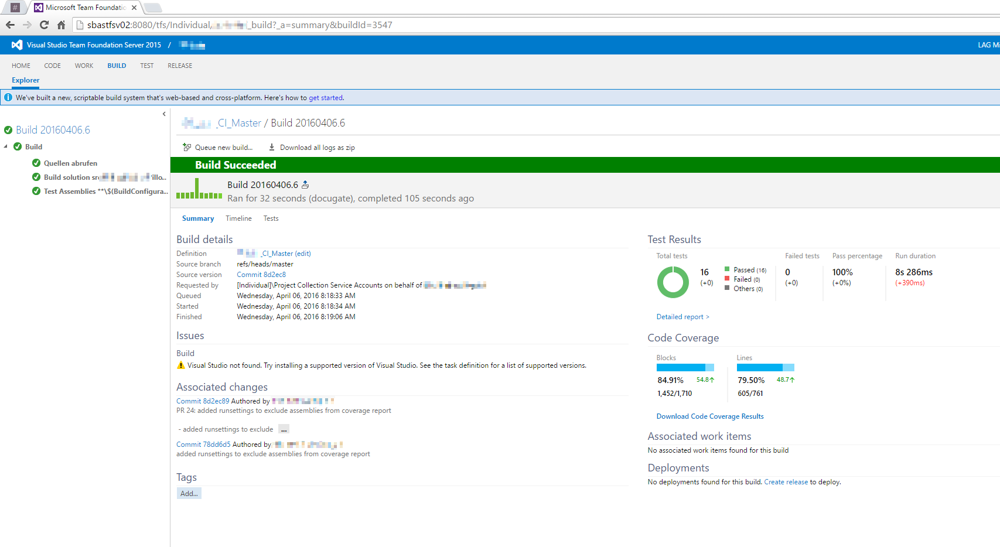

# Automatisierte Unit- und Integrationtests mit Visual Studio und TFS

Entwickler sind wunderbar: Kaffe rein - Code raus, richtig? Doch Softwareentickler haben ein Problem: ihr "Image". Die Welt sieht uns als nahezu perfekte Denker, welche die Probleme dieser Welt mit wenigen Zeilen Code lösen, als Personen welche "alle" Probleme lösen können. Unser Problem damit: Wir haben begonnen das auch zu glauben.

Ja, es ist korrekt, dass viele Sofwareentwickler, welche ich kenne beeindruckende Denker sind. Viele von ihnen haben kein Problem mit einer Code-Basis von mehr als 200'000 Zeilen Code umzugehen und sich darin zurecht zu finden oder beeindruckend einfach Lösungen auf schwierige Probleme zu finden! Doch diese Fähigkeit macht und nicht zur fleichgewordenen Turingmaschine. Wir sind vergesslich, wir sind oft kurzsichtig, wir sind oft zu sehr von unseren Ideen überzeugt - wir sind nicht perfekt!

Besonders stark äussert sich dies im Code den wir schreiben. Ich möchte nicht wissen, wie viele Bugs ich in meiner beruflichen Laufbahn schon zu verantworten habe - und ich werde es wohl (Gott sei Dank) nie! Doch so unausweichbar die Tatsache menschlichen Scheiterns auch für erfahrene und intelligente Softwareentickler ist, müssen wir uns mit der Gegebenheit unserer eigenen Fehlbarkeit auseinander setzen: Jeder Entwickler schuldet es sich seiner Professionalität und seinen Berufskollegen.

Meine berufliche Laufbahn beginnt in einer kleinen Firma als Maschinenbauzeichner. Wir bauten komplete Robotersysteme, welche automatisiert Baugruppen montierten. Ein wichtiger Teil meiner Berufsausbildung bestand daraus, Modelle zu bauen und auf ihre Tauglichkeit hin zu testen. Als Lehrling prüfte mindesten ein weiterer Erfahrener Konstrukteur meine Arbeit und die Resultate dieser Revision konnte vernichtend sein. Ich lernte schnell uns schmerzhaft, meine Abeit zu prüfen - an den vielen tausenden von Normen des Maschinenbaus und am können meiner Kollegen, welche allesamt mehr Erfahrung hatten als ich! Diese Kultur der Selbstkontrolle nahm ich mit ins Informatikstudium.

Jeder Entwickler weiss: Code zu selbst zu prüfen ist wirklich alles andere als einfach. Wir bauen universale Lösungen auf eine fast unvorstellbare Anzahl an Problemen möglicherweise sogar auf Probleme, welche in ihrem Umfang noch nicht einmal erfasstbar sind. Wie funtkioniert Selbstkontrolle in einer solchen Umgebung?

Als junger Entwickler im 21. Jahrhundert kommt man um Begriffe wie TDD, UnitTesting etc. gar nicht mehr herum - die Frage ist jedoch, wischst du sie einfach bei Seite oder kniehst du dich da rein? Ich hatte keine Ahnung, wie ich von einem Maschinenbauzeicher mit einer grösseren Leidenschaft für Code als für Bauteile meine Kultur der Selbstkontrolle leben sollte, bis ich mich mit Testing auseinander setzte. Seit diesem Zeitpunkt ist Testing (und insbesondere automatisiertes Testing) eine meiner grossen Leidenschaften als Softwareentwickler. Ich schreibe gerne Tests, weil sie mich dazu bringen weiter, breiter und tiefer zu Fragen und zu denken. Sie zwingen mich dazu zu spezifizieren, bevor ich implementiere und sie helfen mir dadurch bessere Software zu schreiben. Ich kann es nicht lassen meine Kollegen in dieselbe Richtung zu schubsen, selbst wenn diese Versuche oft auf wenig Begeisterung treffen.

Zu Beginn dieses Jahren hatte ich dann die Möglichkeit eine neue Applikation von Grund auf zu bauen. Jedes Stück Code das ich schrieb, wird durch einen Test spezifiziert und automatisiert geprüft. Es gibt Unit- und Integrationtests, welche zusammen kombiniert eine Code-Abdeckung von über 80% ergeben. Diese Test laufen auf einem Entwicklernotebook in unter 5 Sekunden vollständig durch und werden bei jedem Buildvorgang ausgeführt.

Obwohl das Projekt noch nicht sehr alt ist, konnten wir bereits dank dieser Test Fehler im voraus verhindern und wir haben seit seiner produktiven Einführung nicht einen Bugreport erhalten.

Was möchte ich aufzeigen? Wir Entwickler sollten unsere Superman-Kostüme in die Ecke stellen und uns mit den Gräben unserer eigenen Unzulänglichkeit auseinandersetzen. Eine Möglichkeit dazu sind automatisierte Tests, welche wir für uns, unser Team und die Zulkunft und die Wartbarkeit unseres Produktes schreiben und pflegen. Wir müssen uns eingestehen, dass es perfekten Entwickler nicht gibt, aber dass wir jeden Tag etwas besser werden können!
