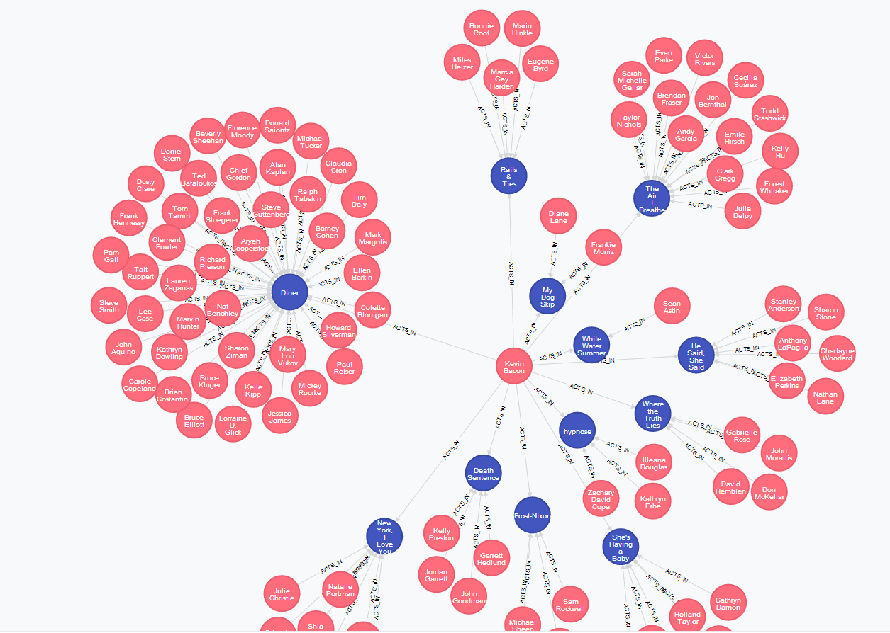

# Datenbanken der andere Seite der Macht

Meine Karriere als Software Ingenieur beginnt ca. 2003 mit einem PHP Skript (ich wollte meine Hausarbeiten abkürzen - hat um den Faktor 10 nicht funktioniert!). Bald entdeckte ich, wie ich Daten in Files schreiben und wieder abrufen kann und wurde dann gleich in MySql eingeführt. Seit diesem Moment benutze ich diese sogenannten ER-Datenbanken überall, wo ich Daten ablegen muss. Später lernte ich, wie ich ER-Daten modellieren sollte, was Normalisierung und ihre Regeln sind, was Primär- und Composite-Keys sind, wie Felder indiziert werden und wie ich schnelle Queries schreiben kann. Das ist heute ca. 15 Jahre her und ich sehe mich gedrängt ER-Datenbanken als meine fits-it-all-Lösung zu begraben. Die Probleme, welche ich heute lösen muss, sind in ER-Datenbanken schlicht nicht mehr effizient abzubilden und so sehr ich es versuche, umso mehr leidet die Übersichtlichkeit meiner Persistence-Layers. Die ER-Modelle werden zu komplex um sie noch schnell abfragen zu können und steigende Datenmengen zwingen mich dazu die wunderbar normalisierten Daten zu denormalisieren um sie dem Nutzer noch präsentieren zu können bevor er eingeschlafen ist. Meine Kunden kommen täglich mit neuen Wünsche, für welche ich die Schemata der Datenbank ändern muss und teure und oft auch mit längeren downtimes verbundene Migrationen zur Folge haben. Die Kosten für die Pflege meiner Persistence-Layers steigen und steigen und kein Ende in Sicht. Wo liegt die Wurzel meines Problems? Benutze ich ER-DBs falsch?!? Benutze ist die falsche ER-Datenbank?!?

Nein. Das Problem liegt tief im Konzept jeder ER-Datenbank verwurzelt! Jetzt gehts in die Tiefe und wenn du über diesen Punkt hinaus bis zum Schluss weiterliest, hast du dir einen Belohnung verdient! Versprochen!

ERM (Entity-Relationship-Model) Datenbanken basieren auf der Grundlage eines gegeben Schemas, welches vom Entwickler festlegt ist und dem DBMS (Database Management System) bei der strukturierten Ablage und Abfrage meiner Daten hilft. Dieses Schema ist fix und Änderungen daran sind oft mit grossen Aufwänden und Risiken verbunden. Weiter setzen die Hersteller von ER-DBs alles daran sogenannt 'ACID'-konform (Atomicity, Consistency, Isolation, Durability) zu sein. Die Folge daraus sind sogenannte Transaktionen welche für das konsistente Abfragen und Verändern von Daten absolut notwendig sind. Diese Transaktionen sperren bei Änderungen die Zeilen, welche geändert werden. Alle anderen Transaktionen müssen dann das Ende einer anderen abwarten (locking) wodurch auch einfachste Abfragen stark ausgebremst werden. Ein weiteres Problem ist die Tatsache, dass zwar jeder Hersteller eines DBMS (z.B Microsoft, Oracle etc.) für diese Probleme Lösungen bereithalten, welche aber nicht überall dieselben sind und teils stark unterscheiden. So sind die Optimierungen welche für ein DBMS vorgenommen wurden wohl ein Bremsklotz für ein anderes DBMS. Wissen ist dadurch nur sehr beschränkt übertragbar oder teuer einzukaufen!

Ein weiteres Problem traditioneller ER-Datenbanken sind grosse Datenmengen: Hier spreche ich noch von ein paar Terrabyte aktiver Nutzungsdaten sondern von Petabytes. Werden einzelne Tabellen zu gross leidet die Performance der Abfragen oft so stark, dass man zu drastischen Massnahmen (Clustering) greiffen muss, welche teuer und hoch komplex sind.

In der Welt hochskalierbarer Systeme sind daher ER-Datenbanken praktisch nutzlos oder müssen stark verändert/eingepackt werden (Youtube ist hier ein gutes Beispiel); ein Aufwand, welcher sich ein kleines Unternehmen schlicht nicht leisten kann! Es gibt einen anderen Weg:

## Dokumenten Datenbanken

Sogenannte Dokument-Orientierte Datenbanken funktionieren auf gänzlich unterschiedlichen Konzepten:

* Sie verfügen über kein Schema
* Sie haben keine Transaktionen
* Durch ihre Transaktionslosigkeit werden hochflexible Sharding-Setups möglich

Der liebe Löwenzahn würde jetzt sagen: Sieht komisch aus - is aber so! Für eingefleischte ER-Entwickler sind diese drei Unterschiede die Unterscheidung zwischen Himmel und Hölle(da gehören Dokumentdatenbanken für sie hin...) und daher werde ich diese schnell etwas erklären und die Konsequenzen und Vorteile dieser Unterschiede betonen!

### Schemalosigkeit
Daten werden in diesen Datenbanken in Form JSON-formatierter Dokumente gespeichert. Diese können zwar in sogenannte Sammlungen gruppiert werden, jedoch kann jedes Dokument in der Sammlung einen anderen Inhalt (Struktur) haben:

```json
{
  "name" : "J.R.R. Tolkien",
  "born_at" : "1892-01-03",
  "died_at" : "1973-09-02",
  "famous_for" : ["Herr der Ringe", "Der Hobbit", "Pfeife rauchen"]
}
{
  "firstname" : "Douglas",
  "lastname" : "Adams",
  "Books" : ["Per Anhalter durch die Galaxis", "Das Restaurant am Ende des Universums"]
}
```

Diese Dokumente können auch indiziert und abgefragt werden. Der Vorteil davon ist, dass durch das 'fehlende' Schema auch eine grosse Flexibilität entsteht die besonders während der Entwicklungszeit Gold wert ist. Auch können gänzlich unstrukturierte Daten (aktueller Zustand eines Windows-Workflow-Foundation Prozesses) abgelegt, indiziert und durchsucht (Volltext Suchen sind super einfach!) werden.
Auch können einzelne Dokumente unabhängig von anderen migriert werden (sollten neue Felder hinzukommen oder umstrukturiert werden).
Einfügen, Editieren und Löschen von Dokumenten sind 'atomare' Operationen und führen nie zu Locking-Situationen mit den Lese/Schreibvorgängen anderer Clients.

### Transaktionslosigkeit
Wie bereits erwähnt, sind das Einfügen, Editieren und Löschen von Dokumenten 'atomare' Operationen. Dies ist ein entscheidender Vorteil, welcher auch massgeblich für die unvergleichbar hohen Abfragemengen auf Dokumentendatenbanken verantwortlich ist. Da die Operationen atomar sind, sind Dead-Locks von Transaktionen kein Problem mehr, und kein Client muss wegen eines anderen auf seine Resultate warten!

Indexierung der neuen/veränderten Dokumenten geschieht synchron ebenso wie die synchronisation mit evetuellen Slave-Servern. Ja, auch die meisten Dokumentendatenbanken können in sogenannten Master-Slave-Setups betrieben werden. Schreiboperation werden auf dem Master ausgeführt, während lesende Operation auf dem Master oder einem der Slaves möglich sind. Der Löwenanteil der Abfragen auf Datenbanken sind lesend, folglich ist es wünschenswert, dass die Slaves, auf welchen gelesen wird, linear skalieren, was sie auch grösstenteils (je nach Datenbank) tun!

### Sharding
Dokumente können anhand von Indizes in verschiedene Gruppen eingeteilt und auf sogenannte Shards verteilt werden.


Eine Collection welche z.B Log-Outputs speichert kann die Logeinträge aufgrund ihres Erstellungsdatum über verschiedene Shards verteilen, welche diese z.B auf unterschiedlich schnellen (und unterschiedliche teuren) Speichermedien ablegt. So können die neusten Logdaten z.B ein einer RAM-Disk, andere auf einer PCIe SSD, Magnetplatte oder gar einen Magnetband gespeichert werden. Entsprechend lange sind natürlich dann die Abfragezeiten, welche Dokumente auf einem oder mehreren unterschiedlichen Shards abrufen wollen. So sind die neusten Logdaten stets sehr schnell verfügbar, während sehr alte dann halt länger brauchen für die Abfrage, was für fast alle mir bekannten Kunden auch verständlich und akzeptiert ist! Shards aufzusetzen ist sehr einfach und kann auch von Entwicklern ohne jahrzentelanger DB-Managementerfahrung umgesetzt werden.

Die hier geschilderten Eigenschaften (welche nur ein sehr kleiner Abriss über die Möglichkeiten mit Dokumentendatenbanken ist) machen Dokumentendatenbanken zu sehr nützlichen Instrumenten und ersetzen bei vielen jüngeren Softwaresystemen die in die jahregekommen und teuren ER-Datenbanken. Sie eignen sich besonders gut zum Speichern von Stammdaten und Informationen welche in rauhen Mengen generiert und/oder gänzlich/teilweise unstrukturiert sind.

Am populärsten in der Welt der Dokumentendatenbanken ist im Moment [MongoDb](https://www.mongodb.org/) (Open Source, super .Net-Integration, allgemein gute Treiber in allen populären Sprachen). Ebenfalls beliebt und etabliert sind [CouchDb](http://couchdb.apache.org/) (Open Source, Apache Foundation Projekt) oder [RavenDb](https://de.wikipedia.org/w/index.php?title=RavenDB&action=edit&redlink=1).

Es gibt aber noch andere Anwendugsfälle in denen auch Dokumentendatenbanken nicht besser/schneller sind als ER-Datenbanken: Wenn man mit hochgradig verknüpften Daten arbeitet. Ein Anwendungsall aus der Praxis könnte eine Raumplanung für eine Schule sein. Hier müssen dieselben Daten oft in ganz unterschiedlichen Kombinationen verknüpft und ausgewertet werden. Es soll möglich sein, auf demselben Modell herauszufinden, wann welche Räume durch wen belegt sind, wann Sie wieder frei sind, ob sie zu einer bestimmten Zeit reserviert oder gar nur in Kombination mit einem anderen Raum reserviert sind, evtl sogar welche Kurse zu welcher Zeit in einem Raum oder welcher Kurs in welchem Raum stattfindet und so weiter...
Dies ist ein wunderbares Beispiel für hochgradig verknüpfte Daten. Selbstverständlich können auch diese Daten sowohl in einer relationalen als auch in einer Dokumentendatenbanken modelliert werden. Aber diese Modelle wären durch die vielen Beziehungen entweder so komplex dass sie kaum noch verständlich und änderbar wären, oder aber sie wären so langsam und generisch, dass Sie praktisch nutzlos sind (weil zu langsam mit vielen Daten).

Glücklicherweise gibt es auch hier eine Lösung, welche uns diese Kopfschmerzen erspart: Graphen!

## Graphendatenbanken
Graphendatenbanken speichern Daten in Form von Knoten, welche über Beziehungen miteinander verbunden sind und werden daher auch als 'Subject-Predicate-Object' Graphen bezeichnet:


Knoten haben eine ID (/user/123) und Beziehungen haben einen Namen (named) und eine Richtung (meist nur eine In/Out, also nicht bidirektional). Sind nun einer oder mehrere Anfangsknoten bekannt, können wir über die vorhandenen Beziehungen weitere Daten abfragen wie `"Welcher Nutzer folg wem und wie Gross ist diese Person?"`, oder `"Wie viele Freunde haben meine Freunde zusammen?"`, oder `"Welche Kurse belegen am Samstag einen Raum?"` oder gar `"Alle Kurse, welche in einer Woche einen Raum belegen!"` beantworten. Diese Abfragen können auch rekursiv sein und die Resultate visualisiert werden: Hier die visualisierte Antwort auf die Frage: `Welcher Schauspieler haben jemals mit Kevin Bacon in einem Film gespielt?`


Solche Abfragen sind selbstverständlich sowohl in relationalen als auch in Dokumentendatenbanken möglich. Jedoch sind sie oft um Grössenordnungen langsamer und massiv aufwändiger.

Die meisten populären Graphendatenbanken (z.B Cayley) persistieren Daten gar nicht selbst sondern speichert diese meist in eine Dokumentendatenbanken deiner Wahl oder im Memory!

Diese Datenbanken eignen sich nicht dazu Stammdaten mit vielen Feldern zu speichern, da jedes Feld zu einer neuen Beziehung und einem neuen Knoten führen würde. Die Graphendatenbanken kann zwar damit ohne Probleme umgehen (Googles Cayley-Installation enhält mehrere Billionen Knoten mit sehr viel mehr Beziehungen untereinander). Das Problem ist eher, dass die Daten unübersichtlich werden. Daher werden Stammdaten oft in einer Dokumentendatenbank gespeichert und die komplexen Beziehungen unter ihnen dann im Graphen abgebildet!

Graphendatenbanken sind wie Dokumentendatenbanken auch schemalos und daher hochgradig flexibel! Hier einige Vertreter dieser Gruppen von Datenbanken:

* [Calyey](https://github.com/google/cayley) (benannt nach dem englischen Mathematiker *Arthur Cayley*, geschrieben in *Go*, verwendet entweder *MongoDb* oder *LevelDb* als Backend, steckt hinter Googles KnowledgeGraph)
* [Neo4j](https://de.wikipedia.org/wiki/Neo4j) (Java implementation, erlaubt auf den Knoten und Beziehungen JSON-Wertepaare zu speichern)

## Fazit

Die altehrwürdigen ER-Datenbanken haben uns Jahrzente wunderbare Dienste geleistet. Leider schaffen Sie es nicht mehr die Anforderungen moderner Applikation in Hinblick auf Geschwindigkeit und Datenmengen zu erfüllen. Dokumenten- und Graphendatenbanken bieten flexible und effiziente Lösungen für hochskalierbare Applikationen. Ihre Schemalosigkeit macht Sie flexibel und ihre Geschwindigkeit ist in der Praxis nicht mehr wegzudenken. Leider ist keine der Datenbanken universell einsetzbar ein Mix verschiedener Systeme ist jedoch mächiger als wenn sie einzeln eingesetzt werden, da Sie Daten gezielt auf Ihren Anwendungsfall modellieren, speichern und indizieren können. Graphendatenbanken ermöglichen es uns hochgradig verknüpfte und riesige Mengen Daten schnell und einfach abzufragen, während Dokumentendatenbanken kein Problem haben mit riesigen Mengen von Daten zu arbeiten, welche gesharded werden können. Die meisten der hier erwähnten Systeme sind heute quelloffen und frei verfügbar.

Wenn du also bis jetzt durchgehalten hast gibt's [hier eine Belohnung](https://www.youtube.com/watch?v=PhB_3Jz0x_s).
